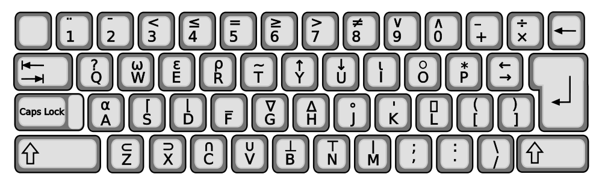
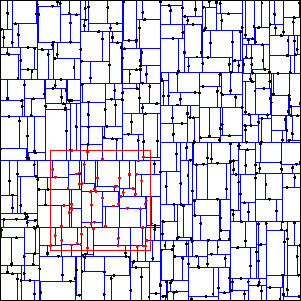
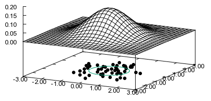
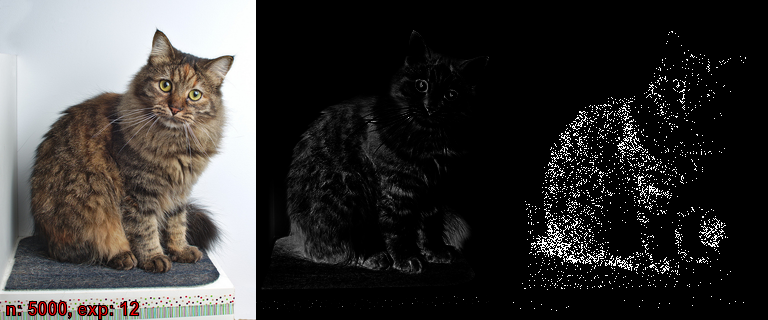
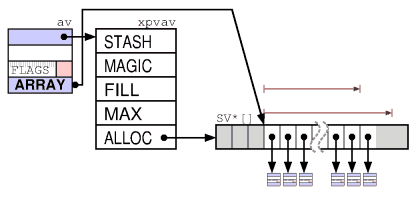
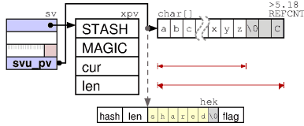
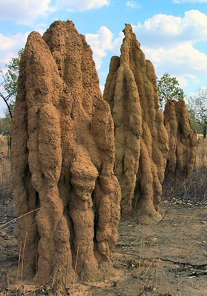
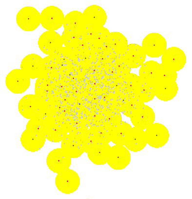
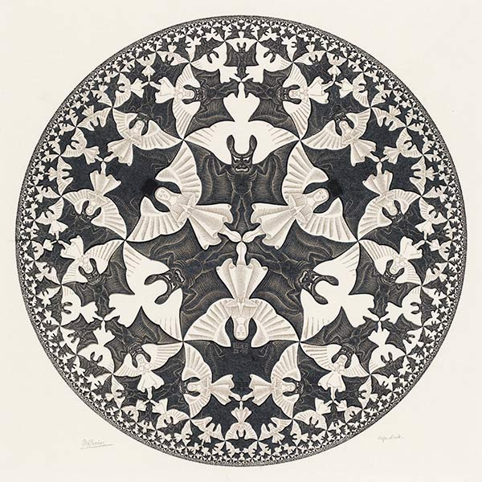
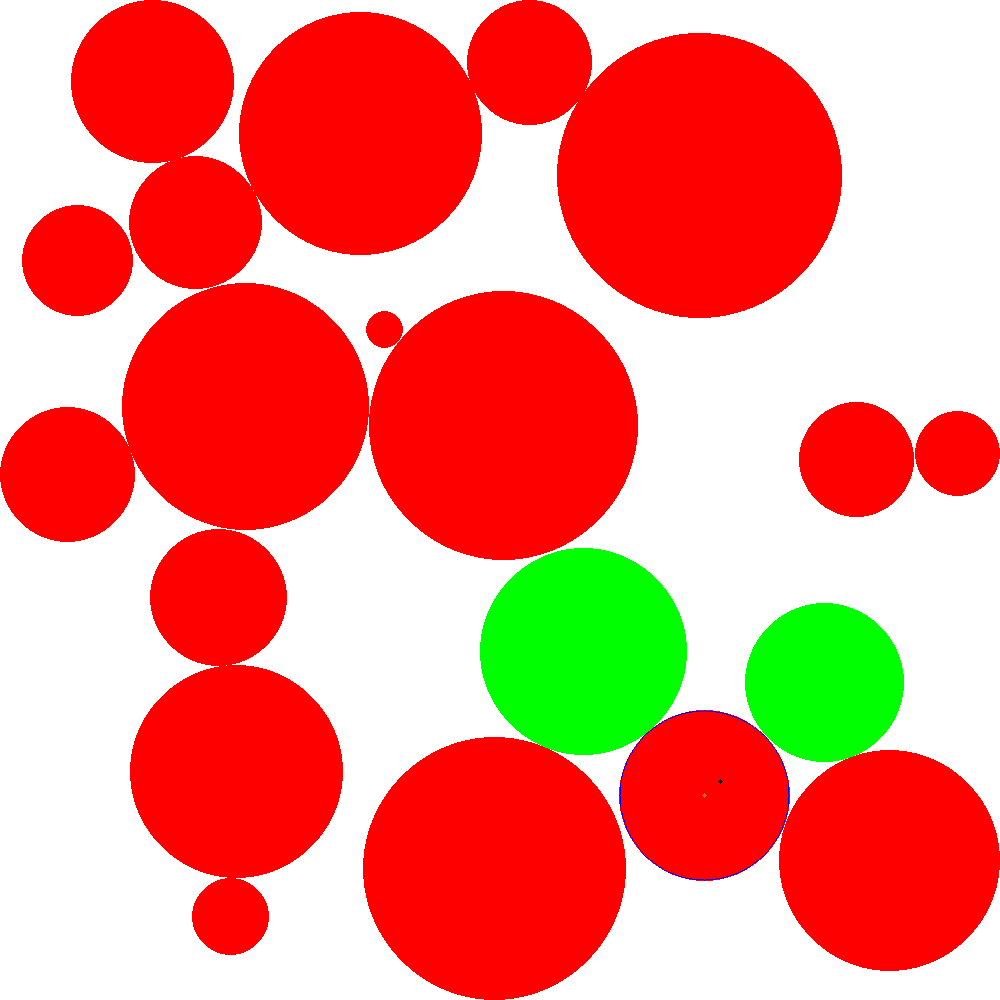

# Perl, vectores, geometría, problemas, algoritmos y arte y todo lo demás...

Salvador Fandiño (sfandino@yahoo.com)

Granada Perl Workshop - Junio 2014

---

# Vector

An Euclidean vector is a geometric quantity having **magnitude** and **direction** expressed numerically as tuples **`[x0, x1, x2, ...]`**.

---

## ... en geometría

- Un punto en el espacio

- Una dirección

- La separación entre dos puntos

- Un eje de giro

- Una rotación

- ...

---

## ... en matemáticas

**(espacio vectorial)**

- Suma y resta, vector nulo (`[0, 0, 0, ...]`)

- Multiplicación por un escalar

- Producto escalar

- En 3 dimensiones, producto vectorial

- Equivalencia con matrices 1xN (v. col.) o Nx1 (v. fila)

---

## ... en Perl

- Vector::Object3D (3D)
- Math::VectorReal (3D)
- Math::Vec (3D)
- Math::GSL::Vector
- y ...

---

## ... Los buenos!

- PDL
- Math::Vector::Real

---

## PDL

- "Perl Data Language"

- Procesado de datos multidimensionales

- Muy eficiente (CPU y memoria)

- Inspirado en APL

---

> ## APL
    
> - "A Programming Language"

> - 196x

> - datos multidimensionales

> - estructuras de control implicitas

> 

---

> ## APL, ejemplos

> Números primos entre 1 y R:

> `(~R∊R∘.×R)/R←1↓ιR`

> Conway's Game of Life

> `life←{↑1 ⍵∨.∧3 4=+/,¯1 0 1∘.⊖¯1 0 1∘.⌽⊂⍵}`

---

> ## [J](http://en.wikipedia.org/wiki/J_%28programming_language%29)

> Variante moderna de APL

> Open Source

> ASCII

> Inspiración de los [adverbios](http://perl6advent.wordpress.com/2013/12/10/day-10-adverbly-adverby-adverbs/) de Perl 6

---

## PDL, inconvenientes

- Curva de aprendizaje

- Soporta matrices, no vectores

- No intuitivo

- Es XS

---

## Math::Vector::Real

- Aritmética con vectores n-dimensionales en el dominio de los números reales

- Fácil de usar e intuitivo

- Escrito en Perl puro

- Velocidad, objetivo secundario...

---

## Math::Vector::Real::XS

- M::V::R reimplementado en XS

- Más rápido x5 ~ x10

- Se carga automáticamente si esta instalado

        use Math::Vector::Real;

- C API...

---

> ## C API

> Problema: Tengo un módulo en XS (`M::S`) y quiero que otro módulo (`M::C`) tambien escrito en XS pueda utilizarlo

---

> ## C API

> - ¿Donde esta el problema?

>   `M::C` puede usar [`eval_pv`](https://metacpan.org/pod/distribution/perl/pod/perlcall.pod).

> - Guardo en un hash (`%M::S::c_api`), punteros a las funciones C que quiero exportar. Desde `M::C`, recupero los punteros y los uso.

>   Ejemplo: [Time::HiRes](https://metacpan.org/pod/Time::HiRes#C-API).

> - o...

---

> ## Module::CAPIMaker

> A partir de la declaración de las funciones que queremos exportar:

>        int foo(double)
>        char *bar(void)

> Genera todo lo necesario para que las mismas se puedan utilizar transparentemente desde código XS en otros módulos.

---

> ## Module::CAPIMaker

> Lo usa

> - Math::Int64

> - Math::Int128

> No lo usa

> - Math::Vector::Real::XS

---

## Math::Vector::Real

    $u = V(1.7, 2.0); $v = V(-1, 3.2)

    $w = 7 * $u - $v + [0, 0.1];
    $s = $u * $w; # producto scalar
    $z = $u x $w; # producto vectorial

    $n = abs($u); # norma

    $v1 = $v->versor;

---

> ## El operador "x"

> Bug [#121827](https://rt.perl.org/Public/Bug/Display.html?id=121827) for perl5: overloading 'x' is broken

>        scalar((...) x $a)

---

## La familia Math::Vector::Real

- Math::Vector::Real
- Math::Vector::Real::XS
- Math::Vector::Real::Random
- Math::Vector::Real::kdTree
- Math::Vector::Real::Farthest
- Math::Vector::Real::MultiNormalMixture
- ... y los ile[git](https://github.com/salva?tab=repositories)imos!

---

## Math::Vector::Real::Random

- Generación de vectores aleatorios

   - versores

   - caja

   - hiperesfera

   - paralelotopo

   - normal multivariante

- Basado en Math::Random

---

## Math::Vector::Real::kdTree

- k-d tree

  

  - estructura simple y muy versatil

  - busquedas n-dimensionales eficientes

      - `find_in_ball`

      - `find_in_box`

      - `nearest_vector`

      - `farthest_vector`

  - otros algoritmos

       - k-means

- módulo "cerrado"

---

## Math::Vector::Real

Metodología de desarrollo: PDD

---

> ## PDD

> ### Pique

> ### Driven

> ### Development

---

> ## PDD

> Alguien me pregunta por correo o en un foro como hacer algo y...

> - a mi se me ocurre un metodo pero tengo que probarlo

> - o se como hacerlo, lo explico, nadie lo entiende

> - o con uno de mis módulos casi se puede resolver

> Entonces, ¡me pico y lo hago!

---

> ## PDD, ejemplo:

> - 17 abril, Mr D.R.

>  > Is there any chance you have a method to calculate the largest distance between two vectors in a set?

> - 25 abril: `Math::Vector::Real::Farthest` en CPAN

> - 20 mayo, Mr D.R. otra vez:

>  > I hate to request [...] but I found an article describing an implementation of k-Means [...]

> - 1 junio: nueva version de `Math::Vector::Real::kdTree` con soporte para k-means clustering.

---

# Problemas

---

## Generación de clusters

Problema: Para validar un algoritmo, necesito generar un conjunto de
puntos n-dimensionales que formen clusters "naturales".

---

### Solución 1: Metodo constructivista

1. De manera ingeniosa me invento una función parametrizable
(u objeto) que sea capaz de generar "clusters".

2. Combino varios de estos clusters mediante una parametrización aleatoria.

Ejemplo:

    my @sphere = map {
            my $center = Math::Vector::Real->random_in_box(3, 1.0);
            my $radius = rand(0.5);
            Sphere->new($center, $radius)
        } 1..$M;

    my @v = map { $sphere[rand($M)]->random_point } 1..$size;

---

### Solución 1: Método constructivista

Limitaciones:

- Los datos generados siguen un patrón

- Los clusters generados no cumplen la condición de "naturales"

---

### Solución 2: Metodo probabilístico:

1. Elijo una función de densidad de probabilidad
n-dimensional `f($v)`

2. Utilizo esa función para generar puntos aleatorios

Ejemplo ([Rejection sampling](http://en.wikipedia.org/wiki/Rejection_sampling)):

        while (@p < $size) {
            my $v = Math::Vector::Real->random_in_box($dim, 1);
            if (rand($max_f) < f($v)) {
                push @p, $v;
            }
        }

---

### Solución 2: Método probabilístico

Limitaciones:

- La probabilidad de descarte puede ser muy alta (*)

- No deja de ser una variante del metodo constructivista

---

### Solución 3: Método "inspirado"

1. Creo una funcion de densidad de probabilidad a partir de otros datos de origen externo

2. Utilizo esa función para generar puntos aleatorios

---

### Solución 3: Método "inspirado"

Ejemplo:

1. Busco una imagen en Google
2. La utilizo para generar una función de distribución bidimensional
3. Genero puntos según esa distribución

---

[image2rand.pl](https://github.com/salva/p5-Tie-Array-Packed/blob/master/sample/image2rand.pl)

    tie my(@acu), 'Tie::Array::Packed::DoubleNative';

    for my $j (0..$height-1) {
        for my $i (0..$width-1) {
            my @c = $img->GetPixel(x => $i, y => $j);
            my $c = ($c[2]*$c[2]+$c[1]*$c[1]+$c[0]*$c[0]) ** $exp;
            push @acu, $acu[-1] + $c;
        }
    }

    my $top = $acu[-1];
    my $ref = tied(@acu);
    for my $r (random_uniform($n, 0, $top)) {
        my $ix = $ref->bsearch_le($r);
        my $j = int($ix / $width);
        my $i = $ix - $j * $width;
        $out->SetPixel(x => $i, y => $j, color => [1, 1, 1]);
    }

---

### Solución 3: Método "inspirado"

Limitaciones:

- Dificultad de obtener datos externos
- Calidad de los datos externos
- Escala mal (dimensión, resolución)

---

> ## Tie::Array::Packed

> - Arrays densos en Perl

> - Reduce el consumo de memoria un orden de magnitud

> - Implementado en XS (pero la interfaz `tie` es lenta)

> - Algunos métodos interesantes (ordenación, busqueda binaria, etc.)

>  Vs 

---

## Generación de clusters

¿Más?

---

### Solución 4: Método emergente

- Pasar horas y horas creando una arquitectura de agentes cuyo comportamiento emergente genere clusters

- AI::Termites

---

`mplayer 'mf://images/termites/*.png' -mf fps=10 -fs`

---

### Solución 4: Método emergente

Limitaciones

- Lento

- Podría haber un patrón oculto

---

## Generación de clusters

PDD:

- [3D test data that exhibits clustering?](http://perlmonks.org/?node_id=908684)

- [Randomly biased, random numbers](http://perlmonks.org/?node_id=1065851)

---

## Recubrimiento

Problema: dado un conjunto de puntos N-dimensionales `A` y un
parametro radio `$r`, encontrar un subconjunto mínimo del mismo `R`
tal que para cualquier punto de `A` exista un punto en `R` a una
distancia menor que `$r`.

---

### Solución 1: Fuerza bruta

- Garantiza solución globalmente óptima

- Complejidad exponencial (probablemente NP-hard)

- En la práctica no es viable

---

### Solución 2: Método del máximo gradiente

Repetidamente elegimos el punto cuya bola cubra más elementos:

    use Sort::Key::Top qw(ikeytail);
    my @R;
    while (@A) {
      my $best = ikeytail { count_in_ball($_, $r, \@A) } @A;
      push @R, $best;
      @A = grep { $best->dist($_) > $r } @A;
    }

---

### Solución 2: Método del máximo gradiente

- Simple y rápido

- La solución suele ser buena, aunque no siempre

---

> ## Sort::Key::Top

> - Selecciona el top-X de una lista

>         @a = keytop { key($_) } $X => @data;

>         # @a = (sort { key($a) cmp key($b) } @data)[0..$X-1]

> - [Algoritmo de selección](http://en.wikipedia.org/wiki/Selection_algorithm)

> - XS, muy rápido

> - Multiples variantes (¡demasiadas!)

---

### Solución 3: Algoritmo genético

- Seleccionamos un conjunto de soluciones diversas y no optimas

- Las cruzamos y mutamos

- Jugamos a la ruleta (cargada) con ellas

- Repetimos

---

### Algorithm::GAUL

- wrapper GAUL: [The Genetic Algorithm Utility Library](http://gaul.sourceforge.net/)

    

    - C
    - rapida
    - flexible
    - parallela (hilos, MPI, ...)
    - abandonada (2009)

- [en progreso](https://github.com/salva/p5-AI-GAUL)... por siempre

---

    my $gaul = Algorithm::GAUL->new(len_chromo => scalar(@p),
                                    population_size => $pop_size,
                                    select_two => 'random',
                                    select_one => 'aggresive',
                                    mutation_ratio => 0.20,
                                    seed => \&seed,
                                    evaluate => \&weight,
                                    adapt => \&repair,
                                    stop => \&stop,
                                    mutate => \&mutate,
                                    elitism => 'parents_survive',
                                    scheme => 'lamarck_children',
                                    crossover => \&crossover);
     while (...) {
         $gaul->evolution(1);
         my $s = $gaul->entity_by_rank(0)->[0];
         ...
     }

---

    sub crossover {
        # say "crossing...";
        my $s = \$_[3][0];
        my $d = \$_[4][0];
        my $p = $_[1][0];
        my $m = $_[2][0];

        my $z = $b0 + $db->random_in_box;
        my $d2 = rand($diam);
        $d2 *= $d2;
        for my $ix (0..$#p) {
            if ($z->dist2($p[$ix]) < $d2) {
                vec($$s, $ix, 1) = vec($p, $ix, 1);
                vec($$d, $ix, 1) = vec($m, $ix, 1);
            }
            else {
                vec($$s, $ix, 1) = vec($m, $ix, 1);
                vec($$d, $ix, 1) = vec($p, $ix, 1);
            }
        }
    }

---

    sub repair {
        # say "repairing chromosomes";
        for my $s (@{$_[1]}) {
            my $m = $missing;
            my $ix = -1;
            while (defined($ix = bu_first($s, $ix + 1))) {
                vec($m, $_, 1) = 0 for @{$cover[$ix]};
            }
            $ix = -1;
            while (defined($ix = bu_first($m, $ix + 1))) {
                my $r = $cover[$ix][rand scalar @{$cover[$ix]}];
                vec($s, $r, 1) = 1;
                vec($m, $_, 1) = 0 for @{$cover[$r]};
            }
        }
    }

---

`mplayer 'mf://images/cover/*.png' -mf fps=10 -fs`

---

## Solución 3: Algoritmo genético

- Dificil saber que esta pasando

    - visualización

    - ajuste del algoritmo

- Dificil mutar y cruzar conservando calidad de la solución

---

> # Bit::Util

> - Funciones para manipular un vector de bits

>     - busqueda (`bu_first`, `bu_last`)

>     - conteo (`bu_count`)

> - en progreso (2012)

> - XS

> - pero código C sin optimizar

---

## Cubrimiento aleatorio del plano

Ploblema: A partir de una figura geometrica básica (triangulo,
cuadrado, circulo, etc.), llenar el plano posicionando la misma de
manera repetida y aleatoria.

---

## Cubrimiento aleatorio del plano

- Subproblemas

    - ¿Como buscar un agujero sin llenar?

    - ¿Que cabe en el agujero?

---

## Math::Geometry::RandomPlaneFiller

- Usa una estructura de k-d tree para particionar el plano (2D)

- Para buscar agujeros

    - Cada region tiene una probabilidad asignada proporcional al área aun libre

    - Cuando se añade una figura nueva se reajustan las probabilidades

- Para medir agujeros (rater)

    - Enumera las figuras existentes ordenadas en base a una metrica parametrizable

- [En progreso](https://github.com/salva/p5-Math-Geometry-RandomPlaneFiller)

    - Solo implementado el soporte para circulos

---

`mplayer 'mf://images/random-plane-filler/*.png' -mf fps=10 -fs`

---

# FIN